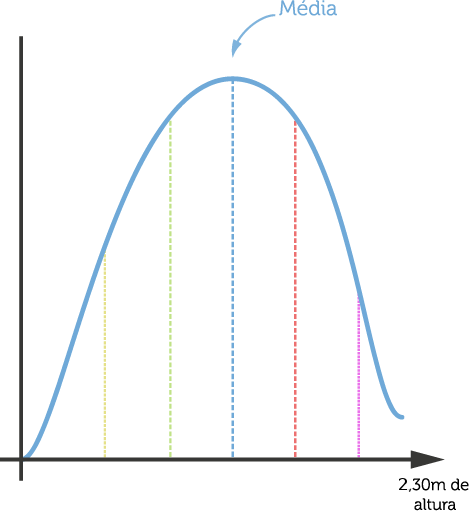

------------------------------------------------------------------------------------------------
<h1>Seção 01 - Qual é o tipo do seu dado?</h1>

Empresas vendem produtos diferentes, o que você vende mais o que você vende menos, e predizer quando venderá mais e como venderá mais.
Usar estatística e aplicar ela no dia a dia.

Antes de começar com Estatística é entender o tipo de dado que estamos lidando naquele momento.

Dados Categóricos
	Sexo: Masculino, Feminino, ou até mesmo Não declarar - Dado do tipo Categórico.
	Não é possível comparar
	
Dado Ordinal (Existe uma ordem)
	Nota: 1, 2, 3, 4.., 10
	Não é possível saber a diferença de um intervalo e outro

Dados Intervalar
	Graus Celsius: 25ºC, 30ºC, etc
	Diferença é mensurável, é precisa

Dados Racional

Os três tipos importantes: Categóricos, Ordinal e Intervalar.

Exemplo:
Nome do Aluno	Aulas Assistidas
Mauricio	2
Natalia		4
Felipe		4
João		6
José		5

Histograma
	- Gráfico que tenta mostrar a quantidade de frequências e quantas vezes elas repetem
	- Quantidade de aulas assistidas
	- Frequencia que as coisas acontecem na distribuição
	
Curva Normal
	- Distribuição em gráfico comum
	- Muita gente na média e pouca gente que está nas extremidades
	- É importante conhecer a curva para saber qual teste estatístico será o melhor teste
	- Entretanto, antes de tudo é necessário saber os tipos de dados
	- Depois pensar no formato da distribuição

Gráfico da curva normal do exemplo

A ideia deste curso é ensinar Estatística Aplicada, ou seja, queremos que você saia daqui sabendo muito mais do que é Média, Mediana ou Correlação, e quando usar cada uma dessas coisas. Temos certeza que você já ouviu aquela frase: "Existem mentiras, grandes mentiras e estatística". E isso não é tão mentira, porque se você não souber escolher o teste certo que você vai aplicar, a função de média correta que você vai usar, você vai chegar em números que não explicam nada sobre o conjunto de dados que você tem.

E estatística hoje é fundamental. Nós temos um monte de informações, sejam elas na política, na economia, nos esportes ou mesmo na sua empresa. A sua empresa vende hoje para um monte de pessoas um monte de produtos diferentes; você pode extrair informações de lá. A estatística vai te ajudar a entender um pouco mais sobre os seus dados: o que você vende mais, o que você vende menos, vai te ajudar até a predizer que produto vai vender mais e quando vai vender mais.

Mas, obviamente, você vai ter que entender estatística a fundo. Aqui não ficaremos entrando naquele matematiquês de como cada teste estatístico funciona. Óbvio que haverá um pouco de matemática porque não tem como fugir disso, mas este curso não é para matemáticos, é um curso para quem quer usar estatística e aplicá-la no dia-a-dia.

A primeira coisa que temos que entender sobre estatística é entender sobre números, sobre os tipos de dados que estamos usando naquele momento. Imagine um formulário que você responde na rua sobre seu sexo:

Sexo:

Masculino
Feminino
Não quero declarar
Este é um tipo de dado que chamamos de Categórico, pois temos categorias e um é diferente do outro e não possuem relação. Masculino não é melhor que Feminino e assim por diante.

Um outro tipo de dado comum é o que chamamos de dado Ordinal. Por exemplo, você acabou de fazer um curso e pedem para você avaliar o professor de 1 a 10:

Nota: ( )1 ( )2 ( )3 ( )4 ( )5 ( )6 ( )7 ( )8 ( )9 ( )10
Esse tipo de dado chamamos de Ordinal porque existe uma ordem: 1 < 2 < 3 <...< 10, mas não conseguimos comparar a diferença do 1 para o 2. Existe o sentimento que de 1 para 2 é a mesma coisa que de 2 para 3, porém não conseguimos medir de maneira precisa. Esse intervalos podem variar de pessoa para pessoa. É diferente medir, por exemplo, uma temperatura: ao medir a temperatura de um ser humano e indicar 36 oC, saberemos que é preciso. De 36 para 37 a diferença é de exatamente um grau Celsius.

A temperatura, então, é um exemplo de dado Intervalar:

25C -- 25,2C -- 26C
A diferença de um para o outro é mensurável e precisa.

Outro tipo de dado, menos comum, é o Racional. Ele é bem parecido com o Intervalar: ele é composto de números em ordem e podemos medir a diferença de um para o outro. Porém, nesse tipo de dado o 0 (zero) significa a ausência daquela coisa. Medindo a temperatura em Celsius, 0 oC significa que está frio, mas não a ausência de temperatura. Em graus Kelvin, 0 K significa a ausência de temperatura. Nos estudos em Física, faz sentido lidar com os dados Racionais, porém aqui em Estatística trabalharemos com os três primeiros tipos de dados: Categórico, Ordinal e Intervalar.

Saber isso é necessário porque dependendo do seu tipo de dado, você tem que escolher o método estatístico certo. Na próxima aula veremos se a Média Aritmética que aprendemos na escola faz sentido para qualquer tipo de dado. Conhecer o seu tipo de dado é fundamental.

Com isso claro, vamos continuar. Raramente em Estatística iremos analisar apenas um número. Nós a utilizamos porque temos um monte de dados e precisamos reduzi-los a um número que os traduza e que possamos entendê-los de maneira fácil.

Vamos começar, então, a agrupar dados.

Exemplo:
Temos os nomes dos alunos de uma escola e a quantidade de aulas que cada um assistiu:

Maurício: 2 aulas

Natália: 4 aulas

Felipe: 4 aulas

João: 6 aulas

José: 5 aulas

Agora queremos entender essas informações: quantas aulas os alunos assistem na escola? Para tal, utilizaremos um Histograma. O Histograma é um gráfico que mostra a quantidade de frequências e quantas vezes elas se repetem.

Quantidade de aulas assistidas	Quantidade de alunos
2	1
4	2
5	1
6	1
Perceba que temos a mesma informação só que disposta de outra maneira.

Porém, com essa tabela, conseguimos criar um gráfico:

histograma

Esse é o Histograma, o gráfico que mostra a frequência em que as coisas aconteceram em minha distribuição. Nesse exemplo utilizamos poucos dados, mas imaginemos uma distribuição maior. Deixaria bem claro o que está acontecendo, em relação às aulas assistidas, na escola.

Se traçarmos uma linha por esse gráfico:

histograma-linha

Essa curva formada é importantíssima e é o que chamamos de Curva Normal. É essa curva que esperamos numa distribuição comum. Se, por exemplo, desenharmos o Histograma da altura de um homem brasileiro, veremos que poucos estarão nas faixas menores e maiores e muitos nas faixas centrais. Muita gente estará na média e pouca nos dois extremos. Entender se sua distribuição está dentro ou não dessa curva também é de extrema importância para escolhermos o teste estatístico ideal. Falaremos mais para frente sobre ela.

Revendo:
antes de estudarmos a Média, ou o Teste de Correlação, ou Teste de Hipótese (veremos tudo isso nas próximas aulas), devemos entender os tipos de dados: Categóricos, Ordinais e Intervalares.
Depois pensamos no formato da distribuição. Uma maneira fácil é desenhando um Histograma, que nos mostra a frequência da distribuição. Os testes a serem aplicados mudam se ela for Normal ou não.
Com essas informações na cabeça, você está pronto para começar a entender mais sobre estatística.

<h2>Tipo de Dado</h2>
Um professor entrega para os alunos um formulário para que eles avaliem o curso. Os alunos podem escolher um número de 1 a 5.
Qual o tipo de dado aqui?
R: Ordinal, temos uma ordem, mas não conseguimos medir precisamente a diferença de um para outro.

Temos uma lista de alturas, em centímetros, das pessoas de uma universidade.
Qual o tipo de dado aqui?
R: Intervalar. A diferença entre um e outro é precisa, mas não existe ausência de altura.

Um cientista tem a lista da temperatura diária no Deserto do Saara, em Kelvin.
Esse exemplo representa qual tipo de dado:
R: Racional. Kelvin é uma medida especial, pois "0" (zero) significa ausência de temperatura.

Uma locadora de filmes tem a lista de tipos de filme que cada usuário gosta. João gosta de "romance", enquanto Maria gosta de "ação".
Qual tipo de dado?
R: Categórico. Afinal, são categorias.

O que é um histograma?
R: Gráfico de barras que mostra a frequência de cada valor num conjunto de dados

---------------------------------------------------------------------------------------------------------------
<h1>Seção 02 - Primeiros passos com R</h1>

Na aula passada nós começamos nosso curso de Estatística com os tipos de dados. Agora vamos começar a colocar isso em prática. Esta aula servirá basicamente para introduzir a ferramenta R. R é uma linguagem de programação muito utilizada por estatísticos, então é uma linguagem em que você tem um monte de comandos com tudo que precisamos de estatística já pronto. Muitas pessoas gostam de utilizar o Microsoft Excel, que é uma boa ferramenta, mas aqui vamos falar de coisas mais avançadas, onde o suporte do Excel deixa a desejar. R é a ferramenta que com certeza é usada por pessoas de Estatísticas.

Instalação
É uma instalação padrão como a de qualquer software que você faz em sua máquina. Ele é gratuito, basta baixar da internet. Então, por exemplo, para o sistema operacional Mac [ou Windows], buscamos no Google "R para MacOS". A pesquisa retorna a página do R para o MacOS. Baixe a versão certa para o seu sistema e faça a instalação. Após seguir os passos de instalação, você está pronto para utilizá-lo.

Nas nossas aulas utilizaremos direto a linha de comando, pois ela é independente do sistema operacional. Se preferir, você pode baixar a versão com a interface gráfica.

Ao digitarmos “R” logo na primeira linha:

Alura:~ alura$ R
O programa retorna diversas informações relacionadas ao R, como a versão instalada e algumas dicas:

R version 3.1.2 (2014-10-31) -- "Pumpkin Helmet"
Copyright (C) 2014 The R Foundation for Statistical Computing
Platform: x86_64-w64-mingw32/x64 (64-bit)

R é um software livre e vem sem GARANTIA ALGUMA.
Você pode redistribuí-lo sob certas circunstâncias.
Digite 'license()' ou 'licence()' para detalhes de distribuição.

R é um projeto colaborativo com muitos contribuidores.
Digite 'contributors()' para obter mais informações e
'citation()' para saber como citar o R ou pacotes do R em publicações.

Digite 'demo()' para demonstrações, 'help()' para o sistema on-line de ajuda,
ou 'help.start()' para abrir o sistema de ajuda em HTML no seu navegador.
Digite 'q()' para sair do R.
O R interpreta tudo que escrevermos: se digitarmos “1”, retornará “1”, se digitarmos “1+1”, retornará “2”. Ou seja, qualquer expressão matemática retornará seu resultado:

>  1

[1] 1

> 1+1

[1] 2

> 3*8+2/5

[1] 24.4

> (3*7)/4

[1] 5.25
Podemos também utilizar parênteses para definir precedência de operações e outros operadores que já estamos acostumados.

Variáveis
Podemos querer guardar resultados de operações para utilizarmos depois. Para tal, utilizamos o símbolo “<-”, que tem formato de seta, após o nome que queremos dar à essa variável (por exemplo “numero”):

> numero <- (3*7)/4
Depois disso, toda vez que digitar “numero” e der ENTER, o programa retornará o resultado da conta atribuída a essa variável:

> numero
[1] 5.25
Podemos fazer contas com ela:

> numero * 2
[1] 10.5
Listas
Um outro comando muito importante para se guardar informações é o método “c( )”, que guardará uma lista de números. Funciona da mesma forma como guardamos uma variável:

> lista <- c(1, 2, 3, 4, 5, 6)
Se digitarmos “lista”:

> lista
[1] 1 2 3 4 5 6
Igualmente, podemos fazer operações com uma lista:

> lista * 2
[1] 2 4 6 8 10 12
Conjunto de Dados e Histograma
Agora vamos utilizar o método de criar listas para montarmos histogramas. Vamos usar o exemplo da aula passada, onde tínhamos os dados de quantas aulas cada aluno assistiu na escola:

> aulas <- c(2, 4, 4, 6, 6, 6, 6, 8, 8, 10)
Com esta lista de dados guardada podemos plotar um histograma de forma muito simples:

> hist(aulas)
No mesmo instante abrirá uma janela com o histograma desenhado:

Temos a opção de customizar esse histograma por meio de comandos que encontramos digitando “?hist”. Para voltar às linhas de comando basta digitar “q”.

Como você deve ter percebido, o R vem com seu próprio manual. Dê uma lida nele para ir se acostumando com os comandos, uma vez que todas essas funções dão suporte a muita coisa. Outra opção é procurar na internet esse manual ou partes dele. Tente digitar “hist R” no Google.

Revendo
Nesta aula aprendemos:

Como instalar o R.
Como fazer uma operação básica em R
Como usar uma variável com um nome qualquer utilizando <-
Listas utilizando o método c( )
Como criar um histograma utilizando o comando hist()

<h2>Operações básicas</h2>

Qual o resultado da operação (1+2)*3/2 no R?
R: 4.5

<h2>Criar listas</h2>
Como se cria uma lista com os números 1, 2, 3 no R?
R: c(1,2,3)
Função c()

<h2>Desenhar Histograma</h2>
Como se desenha um histograma no R?
R: hist(numero)
Função hist() recebe a lista de números e desenha o histograma

<h2>Documentação</h2>
Como ler a documentação da função hist()?
R: ?hist

--------------------------------------------------------------------------------------------------
<h1>Seção 03 - Média, Mediana e Moda</h1>

Média
x1+x2+x3..+xn/n
	
	- Será que essa média aritmética é viável?
	- Talvez seja e talvez não, depende do tipo de dado.
	- Que tipo informação o dado é?
	- Pois, dependendo do tipo de dado, como irá tratá-lo sera diferente

Outliers / Fora da Curva
	- A média aritmética é completamente sensível a outliers, pois um valor muito grande pode afetar

Mediana - Mediana é o elemento que está localizado no meio da distribuição, quando ela está ordenada
	- Pega a distribuição
	- Ordenar em ordem crescente
	- Mediana é o elemento que está localizado no meio da distribuição, quando ela está ordenada
	- Escolher dois números que estão no meio e fazer a média aritmimética para quantidade de números pares.
	- Mediana sofre menos com outliers
	- Ordeno a distribuição e pego a do meio

Se não tiver outliers, a média aritimética é uma boa solução
Se o tipo de dado é ordinal, a média é uma escolha ruim, a mais viável é a mediana.

Moda - Elemento que mais se repete na distribuição

Números Ordinais - Mediana ou Moda
Objetivo: Encontrar tendência central

Média Aritmética
A primeira coisa que iremos mostrar é a Média Aritmética. Muito provavelmente você já deve ter estudado esse assunto na escola. Se pedirmos para você calcular a Média, por exemplo, de 1, 2, 3 e 4, você fará:

(1 + 2 + 3 + 4)/4 = 10/4 = 2,5

De modo geral:

(x1 + x2 + x3 + ... + xn)/n

Agora façamos uma pergunta: será mesmo que para todo conjunto de números devemos utilizar a Média Aritmética para encontrarmos uma Tendência Central? Talvez. Devemos saber que tipo de dado possuímos. Lembra-se da primeira aula de Estatística? A Média serve para dados Ordinais, ou Intervalares? Vejamos um exemplo:

Imagine que você é um professor e no final da aula você entregue um formulário para os alunos preencherem com a nota que eles te dariam, de 1 a 10:

Nota: ( )1 ( )2 ( )3 ( )4 ( )5 ( )6 ( )7 ( )8 ( )9 ( )10  [dado do tipo Ordinal]
Segue que: 1º aluno: 10 2º aluno: 1 3º aluno: 1 4º aluno: 1

Fazendo a Média:

(10 + 1 + 1 + 1)/4 = 3,25
Não é estranho? O 10 dado pelo primeiro aluno não parece exceção? Você é, claramente, um professor nota 1! Perceba que escolher a Média Aritmética, sem pensar no tipo de dado, pode te levar para uma informação estranha.

Veja outro exemplo que pode nos enganar:

Em uma empresa os salários dos funcionários são como se segue:

1º funcionário: 2000 reais
2º funcionário: 2000 reais
3º funcionário: 2000 reais
4º funcionário: 100.000 reais
Calculando a Média:

100.000 + 2000 + 2000 + 2000 / 4 = 26500
Você diria que a média dos salários da empresa é de 26500 reais? Não, porque o 100.000 reais está atrapalhando a média real.

Chegamos à conclusão que temos que pensar em outras soluções para o cálculo da Tendência Central de um conjunto de dados. A Média Aritmética é totalmente sensível aos valores que chamamos de outliers, ou pontos fora da curva.

Veremos agora outras maneiras de calcular a tendência central de um conjunto de dados.

A Mediana
Para o cálculo da Mediana, colocamos os valores dados em ordem crescente e escolhemos aquele valor que é central. Isto é fácil para quantidades ímpares de dados, pois haverá um número que estará bem no meio da amostra. Veja um exemplo:

1 1 6 1 5 10 1 1 1
Em ordem crescente:

1 1 1 1 1 1 5 6 10
O valor central é o 1, que é a nossa Mediana.

Para quantidades pares de dados, pegamos os dois valores centrais e calculamos sua Média Aritmética:

1 1 5 1 2 10 1 6
Em ordem crescente:

1 1 1 1 2 5 6 10
Os valores centrais são, respectivamente, o 1 e o 2. A média entre ele é 1,5, a Mediana que queríamos encontrar.

Perceba que a Mediana é menos suscetível aos outliers. Lógico que isso não significa que a Média Aritmética não é uma boa Medida de Tendência Central. Se sua distribuição é estável, a Média pode ser boa.

Então como saber qual das duas usar? Verifique se os outliers são muito grandes e distantes do resto da amostra. Outra regra é que se o tipo de dado for Ordinal, a Média não é um bom método.

A Moda
A Moda é aquele elemento que mais se repete na distribuição:

1 1 2 2 2 2 2 3 3 5 5 5
Nessa amostra, o número 2 é o que mais se repete, logo ele é a nossa Moda.

Então, verifique qual é o número que mais se repete na distribuição, pois pode ser uma maneira honesta de se calcular a Medida de Tendência Central.

Você irá perceber que numa amostra bem distribuída, a Média, a Mediana e a Moda são iguais ou possuem valores muito próximos.

Dicas:
Com dados Ordinais usamos Mediana ou Moda;
Utilizamos a Média em dados Intervalares, salvo aqueles que possuam outliers;
Desenhe um Histograma, como vimos na aula passada. Verifique se consegue desenhar uma linha parecida com a Normal. Se você tiver uma distribuição normal, o cálculo da Média é um método razoável.

<h2>Calcular tendência central</h2>
Quando nossos dados estão normalmente distribuídos e sem outliers, qual a melhor maneira de se calcular a tendência central?
R: Média serve exatamente para o caso onde a distribuição é normal e não há muitos outliers na distribuição

<h2>Dados dispersos</h2>
Quando os dados estão bastante dispersos, quais são as melhores maneiras de se calcular a tendência central?
R: Tanto a Mediana quanto a Moda podem ser boas maneiras de descobrir a tendência central. A média aritmética é facilmente afetada por outliers.

<h2>Sobre Moda</h2>
O que é Moda?
R: É o elemento que mais aparece/se repete em uma distribuição.

<h2>Melhor tendência</h2>
Olhando para essa distribuição, o que você usaria para achar a tendência central?

[1, 1, 50, 50, 50, 50, 50, 50, 50, 60, 60, 65, 70, 200, 250, 300, 700]
R: Nessa distribuição a média é de 121, a moda e mediana são 50.

<h2>Melhor tendência#2</h2>
Na distribuição abaixo, que representa a medição de altura, em metros, de diversas tartarugas marinhas. Qual é a melhor forma de encontrar a tendência central?

[1, 2, 2, 3, 3, 3, 4, 4, 4, 4, 5, 5, 5, 6, 6, 7]

R: Nessa distribuição a media, moda e mediana, todos, tem o valor 4.

-----------------------------------------------------------------------------------------------------------------
<h1>Seção 04 - Praticando: Média, Mediana e Moda</h1>

Na última aula aprendemos sobre Tendências Centrais: Média, Mediana e Moda. Agora veremos este assunto aplicado ao R.

Escrevemos uma sequência de números quaisquer no R:

> numeros <- c(1, 2, 3, 4, 5)
Revendo: ao digitar "numeros", conseguimos visualizar essa lista:

> numeros
[1] 1 2 3 4 5
Para que o programa calcule a Média Aritmética desses números, digitamos "mean( )":

> mean(numeros)
[1] 3
A palavra Mean significa Média em inglês.

Para o cálculo da Mediana, digitamos "median( )":

> median(numeros)
[1] 3
Nesse caso em particular a Média e a Mediana são iguais.

Vamos agora gravar uma nova lista de números:

> lista <- c(2, 3, 7, 8, 1, 3, 4, 8, 22, 67, 19)
Calculando a Média e a Mediana:

> mean(lista)
[1] 13.09091
> median(lista)
[1] 7
Perceba que o R calcula bem rápido essas medidas. Neste momento somos nós que estamos ditando esses dados de entrata. Em aulas futuras saberemos como importá-los de arquivos CSV.

Infelizmente o R não possui uma função própria para a Moda, porém podemos escrevê-la manualmente. Agora não é o momento, pois irá requerer maior conhecimento de R de sua parte e esse não é o foco da aula.

Vimos nas aulas passadas que é importante saber se a distribuição é Normal ou não. No R rodamos um Teste de Hipótese (veremos em outro momento o que é esse teste) para saber se os dados obedecem uma Normal. Para tal digitamos "shapiro.test( )":

> shapiro.test(numeros)
        Shapiro-Wilk normality test
data:  numeros
W = 0.9868, p-value = 0.9672
Devemos observar o valor de "p-value". Se esse número for muito pequeno, algo em torno de 0,05, não é Normal. Nesse caso ele é próximo de 1, logo devemos acreditar que é uma Normal.

Façamos o teste com "lista":

> shapiro.test(lista)
        Shapiro-Wilk normality test
data:  lista
W = 0.634, p-value = 6.77e-05
Perceba que para "lista" o número é bem pequeno: 6.77e-05 (o "e-05" representa o número 10 elevado a -5, que está multiplicando 6,77). Isso significa que "lista" não é uma distribuição normal.

Outro método que é de costume ser usado no R é o "summary( )", que nos passa várias informações importantes como a Média e a Mediana:

> summary(lista)
   Min. 1st Qu.   Median    Mean 3rd Qu.    Max.
   1.00    3.00     7.00   13.09   13.50   67.00
Esse método resume o que já sabíamos anteriormente: Média: 13,09 Mediana: 7 Valor mínimo: 1 Valor máximo: 67

Em outras aulas descobriremos o que são o 1º e 3º quartis.

Revendo:
Nessa aula vimos na prática como se utiliza o R para: Cálculo de Média e Mediana utilizando, respectivamente "mean( )" e "median( )"; Descobrir se a distribuição é Normal ou não utilizando shapiro.test( )": Se p-value for pequeno, não é Normal Se p-value for próximo de 1, é Normal; * Resumir as informações de uma lista de dados utilizando "summary ( )".

<h2>Função Própria</h2>
Cole o código abaixo no R:

Mode <- function(x) {
     ux <- unique(x)
     ux[which.max(tabulate(match(x, ux)))]
}
Ele cria uma função chamada Mode(), que calcula a moda para uma lista de números.

Teste esse método e diga qual a moda para os números 1, 2, 2, 2, 2, 3, 3, 4, 5, 5, 6, 7.

<h2>Para saber mais: Python Pandas</h2>

Nesse curso estamos vendo a linguagem R muito usada pelos cientistas. No entanto que existe uma outra linguagem não menos popular ou importante na área de estatística e ciência de dados.

O Python está ganhando o seu espaço e a biblioteca pandas está ficando cada vez mais famoso. Através do pandas podemos criar Data Frames igual no R e analisar os dados. Os nomes das funções são bem parecidos. Vejo um exemplo como calcular as tendências centrais com pandas:

>>> import pandas
>>> df = pandas.DataFrame([1, 1, 50, 50, 50, 50, 50, 50, 50, 60, 60, 65, 70, 200, 250, 300, 700])
>>> df.mean()
121.0
>>> df.median()
50.0
>>> df.quantile() #moda
50.0
Caso queira aprender mais sobre mais sobre Python existe uma carreira com vários curso:

https://cursos.alura.com.br/career/desenvolvedor-python

--------------------------------------------------------------------------------------------------------------
<h1>Seção 05 - Variabilidade, Dispersão dos Dados, Outliers e Quartis</h1>

Aplitude
	- Maior menos o menor da distribuição
	- Primeira maneira para ver o quanto os dados estão dispersos
	- Se a amplitude é pequeno significa que os números são mais próximos da média
	- Se a amplitude é grande significa que os números estão mais distântes da média

É necessário sempre "limpar" os dados
Formas de limpar dados
	- Ordenar os números e tirar os extremos

Divisão por Quartis
	- Dividir a distribuição em 3 partes
	- 25 % os extremos e 50% o centro.

3 3 6 7 7 10 10 10 11 13 30
11/4 = 2..= 3

O terceiro elemento é o cara que divide a distribuição

3.11/4 = 33/4 = 8.. = 9
O nono elemento é o cara que divide a outra parte da distribuição

E então descarta o primeiro quartil e o terceiro quartil

Boxplot
	- Gráfico que mostra os 50% da distribuição
	- É possível fazer a mediana do boxplot

Olá! Na aula passada, nós discutimos sobre média, mediana e moda. Agora, vamos usar essas ideias para o nosso dia a dia. Aqui, eu tenho um cenário.

Imagine que eu trabalhe em uma fábrica e essa fábrica tem pessoas que consertam aparelhos. Eu tenho o JOÃO e o JOSÉ, que são dois candidatos a uma vaga que eu tenha aberto em minha empresa. Eu tenho um número sobre essas pessoas:

João

| Frequência | Aparelhos Consertados |
|------------|-----------------------|
| 1          | 7                     |
| 1          | 8                     |
| 1          | 9                     |
| 2          | 10                    |
| 2          | 11                    |
| 1          | 12                    |
| 1          | 13                    |
José

| Frequência | Aparelhos Consertados |
|------------|-----------------------|
| 2          | 3                     |
| 1          | 6                     |
| 2          | 7                     |
| 3          | 10                    |
| 1          | 11                    |
| 1          | 13                    |
| 1          | 30                    |
O João em um dia consertou sete aparelhos; em um outro dia, ele consertou oito; em dois dias ele consertou dez; em dois dias ele consertou 11 e assim por diante. Então, eu tenho a quantidade de aparelhos que ele conserta por dia e a quantidade de vezes em que isso aconteceu.

E a mesma coisa para o José: eu tive dois dias em que o José conseguiu consertar três aparelhos; eu tive três dias em que o José consertou dez aparelhos; eu tive um dia em que o José consertou 30, ele estava super produtivo.

Agora, a pergunta é... Eu tenho João e José e uma vaga só aberta, quem eu contrato? Qual dos dois eu escolho?

Já que na aula passada, em que vocês aprenderam média, mediana e moda, a gente poderia tentar usar isso. Por exemplo, a gente poderia tentar descobrir a média de consertos do João por dia, a média de consertos do José por dia, e ver qual dos dois tem a média maior, porque eu quero contratar o cara que conserta mais aparelhos.

Só que nos números que eu dei para vocês, se você calcular tanto a média, quanto a moda, quanto a mediana dessas duas distribuições, você vai ver que o valor é 10. Exatamente 10. Ou seja, para média, mediana e moda, esses caras são idênticos!

Qual dos dois eu contrato?

Eu estou falando isso porque a média é uma ótima maneira de te dar a tendência central daquela distribuição, mas ela não te explica muita coisa sobre como esses dados estão dispersos. Porque eu quero saber que o cara conserta 7 aparelhos e mais ou menos três por dia. Essa é a média dele. Esse mais ou menos três, essa informação não está nem na média, nem na mediana, nem na moda. A gente tem que achar uma maneira de tentar descobrir o quanto a nossa distribuição está espalhada para complementar a informação da média.

Vamos começar da maneira mais simples, que é a seguinte: Eu poderia, por exemplo, pegar o maior valor que apareceu para mim e subtrair do menor valor. Eu vou chamar isso de amplitude.

A amplitude do João é 13-7=6.

Já a do José é 30-3=27.

O 6 e o 27 me dão uma noção do quanto esses dados estão espalhados.

Nesse exemplo, o José está bastante espalhado - porque eu tenho números grandes e números pequenos - então, a amplitude é muito grande. Já o João tem uma consistência melhor, ele sempre faz mais ou menos a mesma quantidade por dia, por isso o valor dele é 6.

Só que essa maneira de calcular, simples assim como mostrei, o maior elemento da minha distribuição (limite superior) menos o menor elemento de minha distribuição (limite inferior) é uma maneira muito simples porque ela é fácil de ser enganada.

É só olhar, por exemplo, para o José. Ele conserta 3, 6, 7, 10, 11, 13 e, de repente, 30. Ele teve um dia excepcional no trabalho dele que fez com que ele consertasse 30 aparelhos. Mas aconteceu uma vez, foi uma exceção, não acontece sempre. Justamente porque esse 30 está aqui, ele afetou o valor da amplitude.

Está aí uma outra coisa para você se preocupar no seu dia a dia: sempre que você olha uma distribuição, você tem que se preocupar com esses dados que estão muito fora da distribuição, muito fora da curva. Em inglês, nós chamamos isso de outlier, o cara que está muito fora do resto dos dados. E o outlier - eu comentei com vocês na aula da média - ele atrapalha o cálculo. (Lembrem do exemplo do salário. O cara ganha R$2.000; outro ganha R$2.000; outro ganha R$50.000. Esse R$50.000 atrapalha.) Esse outlier de 30 atrapalha o nosso cálculo da amplitude. Essa é uma maneira ruim, portanto, de calcular a dispersão dos nossos dados.

Vamos lá. Antes de chegarmos a uma maneira interessante de calcular essa dispersão a primeira coisa que eu quero discutir com vocês é como filtrar esses outliers. Como jogar esse 30 fora? Como jogar esse 3 fora? Porque esse 3 também é um outlier. Você percebe que 6, 7, 10 se repetem muito mais do que 3. No José é mais difícil dizer, mas o 7 também pode ser um outlier. Um outlier pode ser um cara muito grande ou um cara muito pequeno. Então, eu preciso de uma maneira "procedimental", eu preciso de um jeito mecânico de jogar fora esses outliers.

Como fazemos isso? A gente usa a distribuição por quartis. Eu vou dividir minha distribuição em 4 pedaços.

Por exemplo, o José. Eu tenho aqui a tabela de frequência e eu vou escrever todos os números dessa tabela:

3 3 6 7 7 10 10 10 11 13 30
Então, essa é a distribuição do José. Eu quero dividir ela em 4 pedaços. Então, vamos contar quantos elementos eu tenho: 11 elementos.

Vamos lá, eu quero dividir isso em 4, mas não em 4 partes "exatamente iguais". Eu quero pôr 25% para esquerda, 25% para direita e 50% no meio. Porque se eu tiver 25% para esquerda, 25% para direita, e o que está no meio; perceba que eu joguei os outliers fora, porque os outliers ou são números muito pequenos ou são números muito grandes. E aí a gente acredita que esses números muito pequenos vão morrer nesses 25% primeiros e os números muito grandes vão morrer nos 25% do fim. E eu vou usar somente os 50% do meio da minha distribuição, e ali eu tenho mais ou menos a certeza de que eu não vou ter outlier. Isso é o que chamamos de distribuição por quartis.

Agora, vamos calcular os lugares exatos. Primeira coisa, eu conto o número de elementos. Eu tenho 11 elementos aqui e eu preciso achar a posição do primeiro quartil. E para descobrir isso é fácil. Eu pego o total de elementos da minha distribuição, que são 11 e divido por 4, que são os números de quartis. Isso aqui me dá 2,75, que arredondado para cima dá 3. Você achou a posição do primeiro quartil.

3 3 (6) 7 7 10 10 10 11 13 30
Agora, nós precisamos achar o que chamamos de terceiro quartil. Como que eu faço isso? 3n/4, porque eu quero que 3/4 dos meus dados estejam antes desse terceiro quartil. Então 33/4=8,25, que eu vou arredondar para 9.

3 3 6 7 7 10 10 10 (11) 13 30
E o que está no meio é o que a gente acaba usando nas nossas contas por que 7, 7, 10, 10, 10 não tem outlier e isso representa melhor a nossa distribuição.

Isso é o que chamamos de distibuição por quartis. A vantagem disso é conseguir eliminar os nossos outliers. Então pense nisso sempre que você tiver uma distribuição que tenha esses dados fora da curva. E esse tipo de informação é tão comum que a gente já tem um gráfico que é muito usado no dia a dia, que é o gráfico que nós chamamos de boxplot. Vou mostrar para vocês como ele funciona.

A ideia do boxplot é passar para a gente todas essas informações: o primeiro quartil, o terceiro quartil, a média... em um único desenho.

Vamos desenhar esse boxplot e vamos desenhar para o José. Eu tenho aqui um gráfico de eixo e, para mim, só importa o eixo y nesse momento. Vou começar colocando o menor valor da minha distribuição que é o 3.

Então eu tenho o 3 aqui e no gráfico eu vou representar por um traço simples. O próximo número que eu vou representar é o número do primeiro quartil que é o número 7. Imagine a posição do 7 no gráfico, onde eu vou ter um traço. E a gente até liga esse traço com o traço do número 3. Você já vai entender o desenho como um todo.

O próximo que eu vou fazer é representar o terceiro quartil que é o 11. Coloco o 11 no gráfico e agora eu vou fechar uma caixa.

Lá em cima eu vou representar o maior valor da minha distribuição que nesse caso é 30 - valor bem fora da curva.

E no meio desse gráfico, eu vou representar também a nossa mediana, que nessa nossa distribuição é o 10.

Então, olhem só o que é o tal do boxplot; em um simples gráfico, você sabe:

o menor valor da sua distribuição (limite inferior);
o maior valor da sua distribuição (limite superior);
o primeiro quartil;
o terceiro quartil;
a mediana.

A mesma informação que a gente fez naquele desenho da lista de números, agora está em um gráfico boxplot.

Então, esse gráfico é bastante famoso por causa disso, porque só de bater o olho, você tem ideia de como sua distribuição funciona.

Veja só que a distância no gráfico do número 30 nos dá a noção de que eu tenho outliers. O outlier inferior é pequeno, porque a distância no gráfico é pequena, mas em relação ao limite superior ela é grande, então eu tenho outliers, portanto eu preciso pensar realmente em quartis.

Nesse capítulo, era isso que eu queria mostrar para vocês. Que a média quando eu quero comparar duas distribuições não é suficiente, porque a média me dá a tendência central, mas eu preciso saber também o quanto esses dados variam dentro da distribuição. E assim, começamos a discussão de como chegar nessa variância.

Primeiro, mostrei aquele cálculo simples de amplitude (o limite superior menos o limite inferior), mas a gente discutiu que ela é facilmente influenciada pelos outliers.

Aí chegamos até a distribuição por quartis, cuja ideia é eliminar esses outliers, excluindo 25% dos dados da esquerda e 25% dos dados da direita e usando os 50% que estão no meio da distribuição.

Mostrei como calcular o primeiro quartil e o terceiro quartil:

para o primeiro quartil, pegue o tamanho da sua distribuição e divida por 4, achando um número que, se der quebrado, deve ser arredondado para cima.
a mesma coisa para o terceiro quartil, só que aqui eu multiplico por 3n, porque eu quero o terceiro quartil, então 3n/4, se o resultado der quebrado, deve ser arredondado para cima.
Calculei também a mediana.

E, dessa forma, eu consigo desenhar meu boxplot. E só de olhar meu boxplot, eu tenho uma noção de como é a distribuição.

Fica para vocês como lição de casa desenhar o boxplot do João.

Veja só, o João tem um caso engraçado. O limite inferior é 7 e qual é o primeiro quartil? A gente vai ter que calcular. Vai ficar de lição de casa para você. Então, coloquem até um boxplot ao lado do outro, e você vai ver que isso vai facilitar a sua comparação.

Nos próximos capítulos eu vou chegar nos finalmentes, em como calcular a variância dessas duas distribuições.

<h2>Sobre Outliers</h2>
O que são outliers?
R: São números extremos, geralmente muito grandes ou muito pequenos, no meio de uma distribuição. Geralmente são números que eliminamos na hora de analisar, porque são casos extremos.
Por exemplo, colocar o salaário do Sílvio Santos no meio dos slaários dos brasileiros, alterará o valor da média.

<h2>Você conhece boxplot?</h2>
Quais são as informações que aparecem em um boxplot?
R: Em um boxplot, exibimos: Mediana, Primeiro Quartil, Terceiro Quartil, Maior e Menor elementos da distribuição.

<h2>Quais quartis</h2>
Suponha a seguinte distribuição
20 21 22 22 23 24 24 26 28
Qual é o primeiro e o terceiro quartil?
R:Se você usar o R para fazer esse calculo, a resposta será 22 e 24 pois ele tenta arredondar.

Lembre-se que não há a resposta "precisa" pra isso. A ideia dos quartis é você ter 50% dos dados entre o primeiro e o terceiro. Alguns matemáticos optam por arredondar pra cima, outros por calcular a média. O importante aqui é eliminar os outliers.

-------------------------------------------------------------------------------------------------
<h1>Seção 06 - Praticando: Boxplots</h1>

Olá! Agora que você aprendeu porque quartis são legais e o que é um boxplot, vamos fazer isso no R.

E você vai ver que o R está mais que pronto para isso, então a gente não vai ter trabalho nenhum.

Vou criar uma lista qualquer de números, inventando quaisquer números, por exemplo:

> numeros <- c (1, 3, 5, 6, 10, 19, 23, 5, 7, 89, 15, 14, 22, 23, 32, 23, 37)

E se eu quiser ver o primeiro quartil, o terceiro quartil eu já mostrei o summary, só que agora vocês entendem que esse first quartile e esse third quartile que aparecem aí.

> summary (numeros)

Então o primeiro quartil é 6; o terceiro quartil é 23. E se você quiser ver o boxplot, digite boxplot e a lista e ele automaticamente desenha para mim o boxplot. Simples assim e sem nenhum segredo.

> boxplot (numeros)

Óbvio que você pode customizar esse gráfico. Como você vai descobrir isso? Olhando o manual do boxplot.

> ?boxplot

Dando espaço, o texto desce, e aí você vai ler e entender como ele funciona.

Só que muito rápido, porque o R faz tudo para a gente.

Vou aproveitar e mostrar um truque que eu uso bastante. É o seguinte: eu gerei o gráfico aqui e desenhei o boxplot mas eu não quero ele aqui; eu quero em um arquivo para eu colocar isso em um documento meu, eventualmente em um paper que eu estou escrevendo, então eu quero salvar isso em uma imagem. Como eu faço? Fácil! Eu vou usar a função que se chama png.

png recebe um atributo, um parâmetro: file. E eu vou abrir aspas e aqui eu vou passar para ele o caminho de onde eu vou salvar.

> png(file=" "

Eu vou abrir uma outra aba e vou descobrir em que diretório eu estou. Eu estou em User/alura/.

> png(file="User/alura/boxplot.png"

E eu posso passar para ele até o tamanho da imagem: width de 700 pixels e o height de 700.

> png(file="User/alura/boxplot.png", width=700, height=700)"

Eu coloquei uma aspas sobrando e ele não gostou. Errei. Matei o comando com o comand c [dúvida aqui 02'24], voltou e eu vou apagar essa aspas.

Como que eu fiz ele escrever automaticamente para mim? Seta para cima. Dê uma olhada: a seta no R vai me mostrando os últimos comandos que eu rodei.

Então, de novo: uso o png, com file eu passo o diretório, width eu passo o caminho, height eu passo a altura, sem essa aspas que estava sobrando na linha de cima e dou um enter.

> png(file="User/alura/boxplot.png", width=700, height=700)

Ele entendeu. Ele sabe o que ele tem que escrever nesse arquivo.

Agora eu vou fazer o boxplot.

> boxplot(numeros)

Dá uma olhada, ele não fez nada. Por quê? Porque, agora, ele não tem que plotar na tela para mim, ele tem que plotar no arquivo.

Legal! Já fiz tudo o que eu queria nesse arquivo. Preciso falar para ele que acabei, pode salvar. Eu faço isso com:

> dev.off()

Ele me desce aí 1, que é sucesso. E se eu vier aqui listar, dá uma olhada que eu tenho o boxplot.png. Se eu abri-lo:

Alura: - aluraS open boxplot.png

Ele vai abrir para mim a imagem:

E, dá uma olhada, a imagem está salva no arquivo.

Por que ele não salvou de primeira aqui, quando eu fiz > boxplot(numeros)? Ele esperou, porque quando eu estou desenhando uma imagem no R, eu posso ir passando comandos na linha de baixo, que acrescentam coisas à imagem. Eu poderia mudar a cor da imagem ou de um traço qualquer ali posteriormente. O R me permite fazer. Então, eu vou manipulando essa imagem e quando eu estou satisfeito, eu faço > dev.off(), dou um enter, e ele salvou a imagem para mim.

Veja só que simples.

De novo, a aula com R é sempre bem rápida, porque você já conhece a teoria e a aplicação aqui é natural.

Então, eu mostrei para vocês como desenhar um boxplot, usando a função boxplot, e mostrei também como salvar em um arquivo.

<h2>dev.off?</h2>
Para que serve o comando dev.off()?
Para enviar o buffer para o arquivo de imagem previamente configurado.
Para finalmente salvarmos a imagem que está sendo desenhada na "memória" do R, no arquivo previamente informado.

-------------------------------------------------------------------------------------------------------
<h1>Seção 07 - Variância e Desvio Padrão</h1>

<h2>Entendendo melhor a distribuição</h2>

Pq só a média nao é suficiente quando quero comparar duas distribuição
Pq a média não fala quanto os dados estão espalhados.
É necessário para comparar duas distribuições

Calcular a distância da média de cada número e depois fazer a média de todos os resultados para encontrar a média da dispersão dos dados.

Ex:
1 2 9
Média: 4
Elevado ao quadrado por conta do sinal negativo
= (4-1)^2 + (4-2)^2 + (4-9)^2 / 3
= 9 + 4 + 25 / 3 = 38/3 +/- 13 ----> Variança = raiz de 13 +/- 3.5 ----> Desvio Padrão

O mais importânte é a ideia, o desvio padrão tenta descobrir a distância em relação a média.
Isso da a dispersão da nossa distribuição

Desvio Padrão = 1.73
    João	Média: (7 + 8 + 9 + 10 + 10 + 11 + 11 + 12 + 13) / 9 =  10,11
		Variância: (10,11 - 7)^2 + (10,11 - 8)^2 + (10,11 - 9)^2 + (10,11 - 10)^2 + (10,11 - 10)^2 + (10,11 - 11)^2 + (10,11 - 11)^2 + (10,11 - 12)^2 + (10,11 - 13)^2 = 
Freq	Aparelhos Consertados
1	7
1	8
1	9
2	10
2	11
1	12
1	13

    José - Desvio Padrão = 7.02
Freq	Aparelhos Consertados
2	3
1	6
2	7
3	10
1	11
1	13
1	30

João é mais constante que o José

	
Olá! Na aula passada, começamos a discutir porque que só a média não é suficiente quando eu quero comparar duas distribuições. Porque a média por si só não me fala o quanto a distribuição está espalhada. Ela me dá a tendência central, mas não me fala quanto os dados estão espalhados a partir dessa média.

E eu preciso saber isso para conseguir comparar o João e o José. Qual desses dois será que tem um ritmo melhor de trabalho? Qual tem uma frequência melhor?

Na aula passada começamos a tentar resolver esse desafio e chegamos naquela fórmula da amplitude, em que eu pegava o limite superior subtraia o limite inferior que resultava em um número, só que vimos que os outliers atrapalham. O 30 do José, em particular, atrapalhou bastante a gente.

Começamos a pensar em como eliminar esses outliers e chegamos na ideia da distribuição por quartis. Joga os outliers da esquerda para fora, joga os outliers da direita para fora e uso os dados que estão no meio.

Ótimo! Agora, vamos lá.

Vamos tentar pensar em uma maneira "elegante" de achar essa diferença, esse desvio que os números tem da média.

Para isso eu não vou usar nem o João, nem o José. eu vou usar uma distribuição menor para facilitar os nossos cálculos.

Imagine que eu tenha uma distribuição (1, 2, 9); e a média é 4.

Eu quero pensar, então, como eu posso saber a variância média entre os números. Uma boa ideia seria ver, por exemplo, a distância que o 1 tem da média, que é 4. Então o 1 está a 3 pontos - irei chamar de pontos - da média. O 2 para 4 faltam 2. O 9 para 4 faltam 5.

Então, a minha ideia vai ser essa: vou calcular a distância de cada ponto da média e aí, calcular a média desse número. É a média da dispersão dos dados.

Para essa distribuição fica fácil: (4-1)+(4-2)+(4-9)/3

Divido por 3 porque eu tenho 3 elementos na minha distribuição.

Isso vai me dar: 3+2-5/3

O resultado será 0.

Está aí o primeiro problema da nossa fórmula, porque eu tenho números à esquerda, números à direita e quando eu subtraiu eles da média, eu acabo tendo números negativos. E o número negativo pode cancelar o número positivo. E eu não quero isso. Eu quero que cada ponto do meu gráfico tenha influência nesse valor final.

Vamos tentar melhorar nossa ideia. Como que eu posso fazer para eliminar números negativos?

Uma maneira fácil para isso é pôr esses números ao quadrado. Qualquer número ao quadrado é sempre positivo!

(4-1)^2+(4-2)^2+(4-9)^2/3

3^2+2^2+(-5)^2/3

9+4+25/3

38/3 ~= 13

(Você faça a conta direito, com 2, 3, 4 casas decimais. Aqui, eu estou arredondando para facilitar.)

Eu cheguei no número 13. Esse 13 é minha primeira tentativa de dizer o quanto os números estão dispersos dessa média, na média.

Só que o problema é que como eu elevei esses números ao quadrado, eu não tenho um número em uma dimensão que eu quero. Então, se eu elevei ao quadrado, agora eu vou resolver isso calculando a raiz.

Se eu pegar esse 13 e calcular a raiz dele, eu vou ter aproximadamente 3,5.

raiz de 13 = 3,5

Agora, esse 3,5 me é útil, porque ele está me dizendo que os números dessa distribuição tem a média 4 ±3,5. Então, na média, nessa distribuição, os números estão espalhados por 3,5 para lá e para cá.

Esse número 3,5 tem um nome bonito na Estatística que você já conhece: desvio padrão.

O 13, esse número intermediário que nós usamos para o cálculo do desvio padrão também possui um nome em Estatística: variância.

Veja só que usamos a variância para chegar no desvio padrão, e o desvio padrão dá para a gente o quanto aqueles números estão dispersos.

Mais importante do que a fórmula - porque a fórmula é mecânica e você decora - o importante é a ideia de como o desvio padrão funciona. Ele tenta descobrir a distância daquele ponto em relação à média. Ele faz isso para todos os pontos e calcula a média disso aí. E, assim, temos o desvio padrão. Isso dá para a gente a dispersão da nossa distribuição. E, agora, eu consigo comparar.

Vai ficar de lição de casa para você, calcular o desvio padrão e a variância do João e do José.

Mas você vai ver que na hora de calcular, você vai chegar nos seguintes números:

João 1,73

José 7,02

O que esses números me dizem?

Eles me dizem que o João é mais consistente, porque o desvio padrão dele é MENOR. Então a média é 10±1. Então, quando eu contratar o João a chance que eu tenho dele consertar de 10, -1 para a esquerda, -1 para direita é grande, porque esse é o desvio.

Agora, o José é um cara mais complicado. A média dele é 10, mas ele pode ter um dia muito bom e ele consertar 17; mas ele pode ter um dia muito ruim, e consertar só 3.

Então, talvez, contratar o João te dê mais segurança, porque o João vai fazer 10±1 e o José 10±7.

Nesse caso em que eu quero maximizar o número de consertos, talvez o JOÃO seja uma aposta melhor.

Veja só, que nós tínhamos duas distribuições na aula passada - João e José -, a média era igual - então, para mim, eles pareciam iguais -, mas olha só como o desvio padrão de cada um deles é diferente.

Perceba isso: quando for comparar duas distribuições, não olhe só a tendência central, olhe também o desvio padrão desses dados e você vai entender como aquela distribuição está se comportando.

Nessa aula foi isso: DESVIO PADRÃO e VARIÂNCIA.

<h2>Desvio padrão pequeno?</h2>
Um desvio padrão pequeno indica o quê em relação aos dados?
R: Que os dados estão próximos da média

<h2>Desvio padrão alto?</h2>
Um desvio padrão alto indica o quê em relação aos dados?
R: Um desvio padrão alto indica que os dados estão dispersos.

<h2>Por que elevamos a diferença ao quadro para calcular a variância?</h2>
R: Para que números negativos não interfiram no resultado afinal. Ao elevar ao quadrado, todos ficam necessariamente positivos.

----------------------------------------------------------------------------------------------------
<h1>Seção 08 - Praticando: Desvio Padrão</h1>

Olá! Então, acabamos de ver um pouquinho sobre variância e desvio padrão.

Vamos aplicar isso no R agora.

E você, provavelmente, induziu que é fácil. O R tem tudo isso pronto. Está vendo como foi uma boa ideia usar o R?

Vamos lá!

Criando uma lista de números quaisquer novamente:

> numeros <- c(1, 2, 3, 5, 6, 7, 8, 11, 2, 3, 44, 55, 67, 12, 34, 56)

Se eu quiser calcular a variância:

> var(numeros)

E está aqui a nossa variância: 531.

Mas, a gente sabe que a variância sozinha não fala muita coisa para gente. Então eu vou guardar isso em uma variável que eu vou chamar de variância.

> variancia <- var(numeros)

E aí, eu vou calcular a raiz quadrada da variância:

> sqrt(variancia)

Isso me dá o meu desvio padrão. A gente sabe que o desvio padrão é a raiz quadrada da variância.

Mas eu preciso fazer em dois passos? Claro que não. O R tem pronto:

> sd(numeros)

Que me dá o mesmo valor; o resultado tem que bater.

Então calcular o desvio padrão é fácil: use > sd (standard deviation), passe a lista e ele calcula para mim.

Para deixar mais legal aqui, o que eu vou mostrar agora para você é como ler dados de um arquivo. Porque até então nós estamos criando esses números na mão, mas eu quero ler de um arquivo. Então, imagina que o meu teste estatístico, todo esse meu código que leu com Estatística, ele usa dados que vêm de um lugar. Esse algum lugar pode ser um arquivo .csv, que é aquele formato bastante comum na Computação, que são coisas separadas por vírgulas.

Estou aqui em um diretório qualquer, e eu vou criar um arquivo que eu vou chamar de numeros.csv.

Eu usei o vi as hex que é um editor de texto; você pode usar o bloco de notas, o que você quiser.

E aqui eu vou colocar alguns valores, por exemplo:

|1|2| |2|4| |3|6| |4|8|

Vou salvar esse arquivo e, dê uma olhada, se eu imprimir esse arquivo está lá:

Alura:- aluraS vi numeros.csv
Alura:- aluraS cat numeros.csv 
1,2
2,4
3,6
4,8

Alura:- aluraS
Agora, eu estou no R:

Alura:- aluraS R

Eu quero ler esses números. Como eu faço? Use read, csv - que é o formato -, abro parênteses e vou passar o parâmetro para ele - file -, /Users, /alura - que é o diretório em que estou, eu vou até dar um pwd para confirmar, /numeros.csv.

> read.csv(file="/Users/alura/numeros.csv")

Se você estiver no Windows é: c:...diretório...nome do arquivo. É o caminho completo.

Essa linha aqui: > read.csv(file="/Users/alura/numeros.csv") vai ler todo o conteúdo desse numeros.csv. Só que eu tenho que guardar isso em algum lugar. Vou guardar em uma variável. O método csv retorna para gente uma estrutura de dados com essas coisas.

Então se eu fizer > nums e der um ENTER, dá uma olhada:

> nums

|---| X1 | X2 | | 1 | 2 | 4 | | 2 | 3 | 6 | | 3 | 4 | 8 |

Em X1, ele colocou a primeira coluna que era 2, 3 e 4; em X2, a segunda coluna, 4, 6 e 8.

E eu posso, agora, por exemplo, exibir só uma coluna:

> nums$X1 [1] 2 3 4

Veja só, uma coisa nova no R. O $ (dólar) quando eu tenho essa estrutura que é um dataset, eu consigo pegar uma coluna usando o $.

Posso também traçar o histograma de uma coluna só:

> hist(nums$X1)

Ele me desenhou o histograma e assim por diante.

Então assim que a gente lê de arquivos .csv: read.csv. Eu consigo ler de um monte de lugares diferentes, e aí você olha no manual do R.

Nessa aula eu mostrei para vocês variância e desvio padrão. Simples! O R faz toda a mágica para gente.

<h2>Funçaõ para Desvio Padrão</h2>
Qual a função que calcula desvio padrão no R?
R: sd()

<h2>R e arquivos csv</h2>
O que read.csv() faz?
R: Lê um arquivo csv e transforma em uma estrutura de fácil manupulação no R.

<h2>Dollar no Data Frame</h2>
O que o sinal $ significa em nums$X1?
R: Ela pega a coluna X1 existente em nums

-------------------------------------------------------------------------------------------------
<h1>Seção 09 - População x Amostra: Pensando em um estudo</h1>

Estudo para descobrir qual time brasileiro tem mais torcida, ou qual presidente tem mais votos.
Você terá que ir para rua perguntar.
Para saber com exatidão terá que perguntar para todos os habitantes brasileiros.
É impossível conseguir todas essas pessoas e talvés seja muito caro para falar com essa quantidade de habitantes.
Querer entender como uma determinada população se comporta.
Mas não tenho acesso a população inteiro.
É necessário encontrar a Amostra.
Conjunto de pessoas que eu arranco da população e faço o estudo em cima dessa Amostra.
Vou conseguir generalizar para essa população.
Se eu quiser saber qual o time mais popular, posso falar com uma Amostra da população.
Mas não é tão fácil.
Uma forma fácil de errar é conseguir uma amostra errada.
Ex: Entrevistar pessoas conhecidas, provavelmente todos irão torcer para times parecidos.
Como estatístico é necessário escolher uma amostra ideal.

A Amostra precisa ser Randomica.
Tem que ser aleatório. Qualquer um que estiver na população tem que ter chances de ser escolhido.
Amotra Randomica.

Cenário menor. 500 alunos e escolher de maneira aleatório essa amostra.
E mesmo assim é complicado.

Amostra Estratificada
	- Separar períodos para pegar amostras

Média da Amostra é igual a média da População

A variância da população é maior que a da amostra, por conta disso é subtraído 1 para a divisão da variância.

Olá, então agora você aprendeu um monte sobre estatística. Já aprendeu média, mediana, moda, variância, desvio padrão, distribuição por Quartis etc. Está na hora de começar a aplicar isso, né? Porque, no fim das contas, pra quê você quer estatística? Você quer usar estatística pra entender como determinado grupo se comporta.

Então, imagine que você quer fazer, por exemplo, um estudo pra descobrir qual é o time de futebol brasileiro que tem mais torcida, ou qual é o prefeito ou presidente que vai ser mais votado etc. Você vai ter que ir pra rua e falar com essas pessoas. Então, por exemplo, se você quer descobrir para quem a pessoa torce, você vai ter que perguntar:

Qual é o seu time de futebol favorito?

E é aí que entra o problema. Porque, veja só, imagine que você quer descobrir qual é o time de futebol mais popular no Brasil inteiro. Pra saber isso com exatidão, você teria que perguntar para os nossos mais de 200 milhões de brasileiros para que time eles torcem. É impossível, certo? Impossível por vários motivos:

é impossível conseguir 200 milhões de pessoas
mesmo que você conseguisse, talvez isso seja muito caro. Você vai ter que pagar um ser humano ou uma máquina, qualquer coisa do tipo, pra falar com 200 milhões de pessoas.
O primeiro problema que eu quero mostrar pra vocês é que a gente quer entender como uma determinada população se comporta, veja a palavra aqui população, o conjunto total de pessoas que eu quero estudar, mas não tenho acesso a essa população inteira. Como fazer? O grande segredo da estatística é achar a amostra. A amostra é um conjunto de pessoas que eu arranco dessa população - é um conjunto muito menor, obviamente, fica mais barato - e faço meu estudo em cima dessa amostra. E a ideia é que, se eu selecionei bem essa amostra eu vou conseguir generalizar os números que eu encontrei pra minha população.

Então, é assim que fazemos. Se eu quiser descobrir, por exemplo, qual é o time mais popular do Brasil, eu não preciso falar com os 200 milhões de brasileiros. Eu posso eventualmente falar com mil ou dois mil brasileiros e tentar generalizar isso. Só que não é tão fácil assim quanto parece. No primeiro dia de aula, eu comentei aquela frase, que vocês já devem ter ouvido falar:

Existem mentiras, grandes mentiras e estatísticas

Uma maneira muito fácil de você errar é justamente escolhendo uma má amostra. Por exemplo, imagine o seguinte: que você quer descobrir de novo o time de futebol preferido do Brasil. Aí você decide que vai entrevistar só a família. E pergunta:

Mãe,pra que time você torce? Pai, pra que time você torce? Irmão, pra que time você torce?

Muito provavelmente, todo mundo torce pro mesmo time, e aí você vai descobrir que, no Brasil, todo mundo torce pro time A ou pro time B. Por quê isso aconteceu? Porque eu escolhi a amostra errada. Então, você como pesquisador, como estatístico, tem que escolher a amostra de maneira decente, de maneira correta.

Dicas pra isso: como eu escolho a minha amostra? Idealmente, ela tem que ser randômica. Da seguinte forma: eu tenho a minha população inteira e eu quero pegar pedaços dessa população. Mas, eu não quero pegar pedaços específicos, por exemplo, eu não quero falar com meu irmão, porque o meu irmão está perto de mim. Tem que ser randômico, ou seja, qualquer um que está dentro dessa população tem que ter a mesma chance de ser escolhido nesse meu momento lá de escolher a minha amostra: isso é uma amostra randômica. O que também não é algo tão fácil, dependendo do estudo que você quer fazer.

Imagine que você queira fazer um estudo com os 200 milhões de brasileiros. Pra que isso acontecesse de verdade, idealmente você pegaria a lista telefônica, folhearia, pararia numa folha do meio e escolheria um nome. E aí você escolheu alguém de maneira randômica. Mesmo assim, talvez você ainda tenha um viés, porque talvez haja uma pessoa que mora numa região muito pobre, que não tenha telefone, e cujo nome não esteja na lista. Mas, é uma maneira.

Agora, vamos imaginar um cenário menor. Você quer fazer um estudo na sua escola. Você quer descobrir como os alunos da sua escola se comportam. Então, você tem lá, 500 alunos e você tem que escolher de maneira aleatória um desses 500 alunos. É assim que funciona e é o que nós chamamos de amostra randômica.E, mesmo assim, isso é complicado. Imagine que você quer descobrir como os alunos da sua escola funcionam. E você quer descobrir qual é o melhor professor da sua escola. Se você tem aulas nos turnos da manhã, tarde e noite, só pegar alunos da manhã pode ser complicado. Ou pegar só alunos da tarde, ou só alunos da noite. Porque esse grupo de pessoas pode ter opiniões diferentes, então você tem que tomar cuidado com todas essas possibilidades.

Uma outra maneira conhecida pra você conseguir a sua amostra é fazer o que nós chamamos de amostra estratificada. Como assim? Por exemplo, se eu sei que existem grupos. Na minha escola, eu tenho as turmas da manhã, as turmas da tarde e as turmas da noite. Aí eu separo manhã, tarde e noite, e dentro desses grupos eu randomizo e pego alguns alunos, pra garantir que eu vou ter sempre alguns alunos de cada turno. Generalizando de novo, imagine que você queira descobrir times de futebol do Brasil, só que você só entrevista pessoas do sudeste pra baixo. Aí, obviamente, vai dar São Paulo, Corinthians, Grêmio, Internacional... Mas, ninguém vai falar que torce pro Sport, por exemplo, porque você não pegou pessoas do nordeste. Então, se eu fosse fazer uma amostra estratificada no país, eu pegaria um pouquinho de pessoas do sul, um pouquinho do sudeste, um pouquinho do norte, nordeste, centro-oeste. Isso é o que nós chamamos de amostra estratificada.

De novo: existem técnicas diferentes pra você buscar por conjuntos de pessoas. Então, eu já falei pra você que você tem que selecionar com carinho na hora de selecionar sua amostra. Agora, vamos entender no nosso desenho, no nosso gráfico, como isso ficaria. Imagine que aqui eu tenha um histograma, lembra do histograma? Ele conta pra mim, mais ou menos, a frequência pela variável que eu estou medindo, como, por exemplo, a altura da população. Então, aqui eu tenho, nesse eixo (horizontal) a altura, nesse eixo (vertical) a frequência. Quantas pessoas têm 1,50m? Quantas têm 1,60m, 1,70m etc? E a gente sabe que, se a nossa distribuição for normal, a nossa curva é mais ou menos assim, certo?

Imagine que isso (a curva) é a minha população. Quando eu seleciono a minha amostra menorzinha, pronta pra ser estudada, estou imaginando que o histograma dela é mais ou menos assim:

Parecido com o da população. Imagine que é uma normal também, só que tem menos dados. É essa a diferença da população pra amostra, certo? Eu tenho simplesmente menos dados.

Sabendo disso, eu quero agora, então, calcular as coisas para a amostra que é a que contém os meus números e generalizar pra população. Média, como a gente faz? A média, dado que as distribuições são normais, nós acreditamos que a média da amostra é igual à média da população. Simples assim, sem segredo. Mas, agora, a pergunta é a variância. Lembra o que é a variância? É mais ou menos quando os números estão espalhados no gráfico. Nesse caso, como nós sabemos que a população é muito maior e provavelmente tem aqueles outliners etc, nós temos uma fórmula um pouquinho diferente de calcular a variância.

Vamos lá. Você lembra que, para calcular a variância, eu fazia a diferença de cada número para a média e dividia pelo número de elementos? Vai continuar a mesma coisa. Então, eu vou dar o mesmo exemplo da aula passada. Deixa eu ver os números:

1, 2 e 9
Média: 4
Então, a nossa fórmula era assim, certo? A média menos o número, mais a média menos o próximo número, mais a média menos o último número, dividido pelo número de elementos. (4-1)+(4-2)+(4-9)/3

E aí, nós tínhamos aquele problema de que aqui (no último parêntese da fórmula) o número fica negativo, um cancela o outro, e nós resolvíamos isso elevando o numeral ao quadrado.

(4-1)²+(4-2)²+(4-9)²
Até aqui, sem segredo. A diferença é que nós acrescentamos um "-1"

(4-1)²+(4-2)²+(4-9)²/3-1
Esse "-1" é a diferença pra gente calcular a variância da amostra. Por que -1? É uma convenção da estatística. Eu não vou entrar nos detalhes profundos disso, mas, a ideia é a seguinte. Se eu tiro o número 1, o resultado final dessa conta vai ser um número maior, certo? Se eu dividir por 2, o resultado é maior do que se eu dividir por 3. Por que eu faço isso? Porque eu sei que a variância da minha população é maior do que a variância da minha amostra. Então, é por isso que eu tiro um número aqui (na divisão), pra que esse número fique um pouquinho maior e aí, por consequência, mais parecido com o da minha curva azul aqui (imagem I) que é a da população. É isso, basicamente, que muda na hora de tentar generalizar. Faço lá a estatística descritiva com média, desvio padrão, variância etc da amostra pra população. Então, é isso: a média é igual e a variância você acrescenta "-1" na parte de baixo da sua divisão pra que o número fique maior e provavelmente muito mais parecido com o da população.

Nessa aula, eu discuti com vocês as amostras, que é um assunto fundamental num trabalho de estatística. Idealmente, você não consegue alcançar sua população inteira, você precisa selecionar um conjunto de sujeitos, de pessoas ou do que você está fazendo o seu experimento e, idealmente, essa amostra é representativa em relação à população. Como aquele exemplo que eu dei pra vocês do Brasil, se você vai ver times de futebol, você não vai olhar só o sul e sudeste, você tem que conseguir pessoas do Brasil inteiro. Não vai entrevistar só as pessoas da sua casa. Se você quer descobrir alguma coisa da sua universidade, você não vai falar só com os alunos do período da manhã, porque os alunos do período da noite são diferentes e fazem parte dessa população. É assim que nós tentamos fazer estudos sem ter acesso à população, pensando nessa amostra.

<h2>Sobre amostra</h2>
O que é uma amostra?
R:Uma parte significativa e atingível da população, que usamos para nossos testes e estudos.

<h2>Divisor da fórmula</h2>
Porque subtraímos 1 do divisor na fórmula da variância da amostra?
R: Para que o valor da variância fique maior, e dessa forma, mais parecido com o valor real da população.

<h2>Valor da variância</h2>
Se a quantidade de elementos na amostra é grande, o que acontece com o valor da variância?
R: Quanto maior, mais parecido com o valor da variância da população ela será.

---------------------------------------------------------------------------------------------------------------
<h1>Seção 10 - Praticando: Graus de Liberdade</h1>

População != Amostra

Amostra é o que temos em mãos quando estudamos

Variância acreditamos que a variância da populção seja maior que a variância da amostra. Usamos:n -1

Degrees of Freedom ou Graus de Liberdade

Se a amostra é grande, a variância da população e da amostra serão parecidos.

Graus de Liberdade = Variáveis que podem ser mudadas a vontade.

Olá!

Na lousa, eu mostrei pra vocês a diferença de população e amostra. E mostrei que amostra é o que nós geralmente temos em mãos quando vamos fazer um estudo. E mostrei também que a fórmula da variância, em particular, muda se for pra amostra ou pra população. A gente coloca um n-1 no divisor. E a gente subtrai 1 por quê? Porque nós acreditamos que a variância da população seja maior do que a da amostra. E aí esse -1 faz com que o número fique maior, e a gente acredita que isso é mais próximo da variância da população. Esse n-1 é o que nós chamamos, em inglês, de degrees of freedom (graus de liberdade). E essa aula em particular eu não vou mostrar no R, até porque não tem muita coisa pra mostrar, mas vou mostrar pra vocês de onde veio esse n-1.

Então, graus de liberdade, degrees of freedom, eu falei pra vocês que é n-1. Imagine o seguinte exemplo: se eu disser pra você que eu tenho quatro números que eu não sei quais são: x, y, z e t (planilha do excel, respectivamente: A2, B2, C2, D2). Só que eu sei que a soma de x+y+z+t = 10. Aqui o excel não faz, obviamente, porque é variável. Mas, eu sei que a soma tem que ser 10. A minha pergunta é, que número eu posso pôr em x? Se são quatro números, e x é o primeiro número. Que número eu posso pôr em x? Qualquer um. O número que eu escolher não tem problema,se eu escolher 600, eu vou poder ter uma combinação de outros três números cuja soma vai me dar 10. Vamos supor que o primeiro seja 3 (x=3). O próximo número agora, que número pode ser? Também qualquer um. O número que eu escolher, eu vou poder dar um jeito de que os próximos dois corrijam pra dar 10. Vamos supor que o próximo seja 2 (y=2). Agora, eu estou no terceiro número. Que número pode ser? Também qualquer um. Vamos supor que seja 1 (z=1). Ótimo. Agora, o quarto número, que número pode ser? Aqui, veja que eu não tenho escolha. Se eu sei que a soma é 10, pra esse número aqui, dado que os anteriores são 3, 2 e 1, esse aqui tem que ser 4. Pra que a soma de A2+B2+C2+D2 seja 10. Veja que, de quatro números, eu tinha três que podia escolher à vontade: isso são os graus de liberdade, degrees of freedom. E você vê que isso aparece em vários momentos da estatística.

Na fórmula da variância, em particular, vamos entender o que é que acontece com esses graus de liberdade. Porque é isso que a gente está fazendo, dando um grau de liberdade que é o n-1. A gente tem um grau a menos de liberdade do que a gente usa lá na fórmula da população. Imagine que a soma eu já saiba, porque ali na variância a fórmula é a soma da diferença do número pra média ao quadrado, dividido por n. Então, imagine que eu já saiba que a soma daquilo é 240. E vamos imaginar que n=4. Se n=4, na fórmula da população vai ficar 240/4. E na fórmula da amostra, vai ficar 240/3. Dá uma olhada em como ficou: da população é 60, da amostra é 80.

n=4 População: 240/4 = 60 Amostra: 240/3 = 80

Vamos aumentar esse número para n=8.

*População: 240/8 = 30
*Amostra: 240/7 = 34,28571429
Se aumentar mais ainda, n=20

*População: 240/20 = 12
*Amostra:240/19 = 12,6317895
Veja só, antes era 60 e 80, a diferença era grande; 30 e 34. Quando foi pra n=20, ficou 12 e 12,6 já está bem perto. Agora, dá uma olhada em n=120

n=120
*População: 240/120 = 2
*Amostra: 240/119 = 2,016806723
A diferença já caiu pra 01. O que isso quer dizer pra gente? Quer dizer que se a sua amostra tem mais de 120 pessoas eu nem preciso muito mais olhar aquele "-1", porque eu já estou vendo que os números são parecidos.E por quê eu estou dizendo isso? Eu estou dizendo que dependendo do número de pessoas que você tem no seu estudo, de elementos que você colheu ali, você não precisa nem se preocupar em usar o n-1 na fórmula. Isso porque os dois números serão muito parecidos. Então era isso que eu queria mostrar pra vocês aqui: que tem aquela fórmula lá da amostra, em que a gente faz o n-1, só que ela faz sentido quando a sua amostra é muito pequena. Quando a sua amostra é grande, os números serão parecidos tanto da fórmula que você usa de maneira normal, pra variância, quanto da fórmula que você usa pra amostra. E esse n-1 é o que nós chamamos de graus de liberdade.

E agora você entendeu também, embora eu não vá entrar no detalhe matemático da coisa, de quando usamos o tempo inteiro... Mas quando alguém diz que tem 4 graus de liberdade, quer dizer que 4 variáveis estão livres, podem ser mudadas à vontade. Foi exemplo que eu dei pra vocês com o numeral 10 no início. Pensa, nesse nosso último exemplo, que aquele n-1 é o grau de liberdade pra chegarmos nessa soma de 240. Se eu tenho n-1 graus de liberdade, quer dizer que eu tenho n-1 números que eu posso mudar, e só o último tem que ser fixo ali.

É isso que eu queria mostrar na aula, então não fique muito preocupado se você usar a fórmula da variância comum, dependendo do tamanho da sua amostra, porque vai dar mais ou menos na mesma, tá legal?

<h2>Fórmula da Variância</h2>
Por que a fórmula da variância para amostras pode ser "ignorada" quando a amostra é grande?
R: Por que, como usamos n-1 como graus de liberdade, e a fórmula da variância usa n, quando o número é grande, o resultado acaba sendo muito parecido. Como visto no vídeo, a partir de 120 amostras, a diferença entre um e outro é por volta de 0.1.

---------------------------------------------------------------------------------------------
<h1>Seção 11 - Diminuindo o erro: Intervalos de Confiança</h1>

Ao invés de falar a certeza da média da amostra.
Não adianta falar o número fixo.
É necessário usar um Intervalo
Chamado como Intervalo de Confiança. 6 a 8, por exemplo.
E existe um nível de confiança que é em porcentagem. 95%, por exemplo.

Quanto mairo o nível de confiança, maior o intervalo de confiança.
Por exemplo, a altura dos Brasileiros, se você quiser 100% de certeza em um nível de confiança, o intervalo pode ser de 90 cm até 2,10m. O que adiantou esse grande intervalo?

Geralmente é utilizado 95% em um nível de confiança.

Vamos continuar. Na aula passada, nós discutimos então sobre amostras. Eu tinha minha população, eu não consigo chegar nela inteira, preciso fazer meu estudo na minha amostra. E aí eu mostrei pra vocês como se calcula média na amostra, como se calcula variância na amostra etc. Só que a gente tem um problema. Nós tínhamos aquele gráfico que era mais ou menos assim: um histograma, e a população era alguma coisa parecida com isso . Era uma curva normal, parecida com uma normal. E a amostra, nós acreditamos que é alguma coisa muito parecida só que com menos dados nesse histograma, então é alguma coisa assim :

amostra

Imagine que você descobriu que a média dessa população é 7. Corrigindo: a média da amostra é 7. E aí eu falei pra vocês que nós acreditamos que a média da amostra é a média da população. Mas, imagine que você teve acesso à amostra, calculou que foi 7 e aí você, por algum motivo, teve acesso à população. E descobriu que a média da população não era 7, era 7,3. Teve uma pequena diferença. O que faz sentido, porque a amostra não é a população inteira, a gente está tentando estimar.Você consegue ver o problema de dizer pra alguém que a média é 7, sendo que você não tem essa certeza absoluta? Você não consegue afirmar, com certeza, que a média é 7. Então, o que a gente faz nesses casos? Nesses casos, para não errar tão feio, a gente prefere dar um intervalo pra essa pessoa. Assim, ao invés de falar pra ele que eu tenho certeza que a média dessa população é 7, eu prefiro falar o seguinte. A média dessa população está entre 6 e 8 e eu tenho por volta de 95% de certeza de que isso é verdade.

Veja que é muito melhor eu acertar a expectativa com o meu usuário, com o que eu estou fazendo. É nisso que eu quero chegar, não adianta eu falar um número fixo. Porque você não vai acertar. A gente sabe que, na prática, raramente a média da amostra é idêntica à média da população. Por isso, a gente usa o que chamamos de intervalo de confiança. No exemplo, o meu intervalo de confiança é de 6 a 8. E esse 95% que eu coloquei pra vocês é o que nós chamamos de nível de confiança. Obviamente, um está relacionado ao outro, porque dependendo do nível de confiança que eu quero, eu vou ter um intervalo maior ou menor.

Só que pensar no nível de confiança é complicado. Porque, veja só, se eu dissesse pra você que preciso saber a média dessa população com 100% de certeza. Ou, vamos generalizar mais fácil ainda: preciso que você me fale a média das alturas dos brasileiros com 100% de certeza, você não pode errar, sua vida depende disso. Se você pedisse isso pra mim, eu responderia que o intervalo de confiança da altura do brasileiro varia entre 90 cm e 2,20m. Com 100% de certeza. Percebe? Se eu coloco o nível de confiança muito alto, o que acontece com o meu intervalo? Ele abre. A única maneira de ter 100% de certeza é tendo um intervalo muito grande. Só que adiantou o que essa resposta? Se eu falar pra você que a altura do brasileiro varia de 30cm a 2,5m? Não te contei nada novo.

E aí, tem o lado contrário. Se eu quiser falar pra você que a altura do brasileiro, a média é entre 1,70m e 1,71m, vou ter que dizer que eu tenho 10% de confiança, porque é difícil falar um número desses. Então, você tem que balancear o seu nível de confiança. Geralmente, via de regra, a gente usa 95%. Esse é um número que é bastante aceito por diversas comunidades. Por exemplo, a comunidade de computação usa o muito o número 95%. Já a medicina, que é uma coisa mais delicada, não pode errar... Imagine que estejam fazendo um estudo com remédio, não pode errar. O nível de confiança geralmente é 99%.

Como calcular o intervalo de confiança dada uma distribuição? Aqui, eu não vou entrar na matemática da coisa, porque isso começa a ficar bastante complicado. Eu vou mostrar a teoria em alto nível e depois a gente aplica usando o computador. É alguma coisa mais ou menos assim. Eu vou desenhar de novo a nossa normal aqui. Aqui está a média. E aí, eu tenho os nossos desvios padrões. Nós sabemos que uma distribuição tem, geralmente, três desvios padrões, tanto pra direita quanto pra esquerda.

O que essa galera da estatística faz pra calcular esses intervalos de confiança? Eles conseguem olhar essa curva normal como um cálculo de probabilidade. Como assim? Imagine que isso (eixo horizontal) é a altura da população brasileira. O cara que está aqui nesse extremo é alguém extremamente alto, que tem, por exemplo, 2,30m de altura. Então ele está bem no extremo. A gente olha pra essa curva e tenta descobrir qual é a probabilidade de eu ter um número aqui (onde está marcado 2,30m). Eu consigo fazer isso porque eu sei a frequência de cada uma das alturas das pessoas, então eu consigo tentar calcular a probabilidade desse cara estar aqui (com 2,30m).

probabilidade

Quando eu digo que o meu nível de confiança é de 95%, eu estou dizendo que há 95% de chances de eu ter um número nesse intervalo de 6 a 8. Quando eu falo de 100% de nível de confiança, eu estou dizendo que a chance do número estar dentro dessa curva é 100%, estou olhando pra tudo. Então, se você pega 100% de confiança, geralmente você começa na altura que é 30cm (extrema esquerda do gráfico) e acaba no 2,30m (extrema direita). O 95% de confiança é mais ou menos boa parte do nosso gráfico. Até porque, a gente sabe que, três desvios padrões para a esquerda e três para a direita, você tem a média.Três desvios padrões pra cada lado dá por volta de 99,7% da distribuição. Quando a gente fala 95, consideram-se por volta de 2,5 desvios padrões mais ou menos pra cada lado da distribuição. Eu não vou entrar na matemática doida da coisa, porque isso faz todo sentido pra quem é estatístico, pra quem está cursando uma graduação de estatística. Pra nós que somos pessoas que aplicam estatística no dia-a-dia, importa é entender o que é um intervalo de confiança.

E, retomando, o que é um intervalo de confiança? Eu tenho um nível, o meu nível de confiança é de 95%, e eu quero ter a certeza, eu tenho a certeza, de que a minha média está entre esse intervalo (de 6 a 8). E essa é a confiança. Como que eu calculo isso, pra gente agora não importa, mas é basicamente probabilidade. Então, é assim que nós fazemos quando queremos ser claros na hora de explicar a média de uma mostra e tentar generalizar pra população: damos um intervalo de confiança.

<h2>Intervalo de confiança</h2>
O que é intervalo de confiança?
R: É o intervalo estimado de algum parâmetro estatístico, como média. Ou seja, ao invés de afirmarmos que a média é "90", dizemos que a média está entre "88" e "92", com 95% de certeza.

<h2>100% de confiança?</h2>
Por que não podemos ter um nível de confiança de 100%?
R: Porque isso implacaria em termo um intervalo muito aberto.

<h2>10% de confiança?</h2>
Por que não podemos ter um nível de confiança de 10%?
R: Porque teríamos um intervalo muito fechado, mas provavelmente errado. Por exemplo, poderíamos dizer que a média de altura do brasileiro está entre 1.78 e 1.79, com 10% de certeza. O intervalo é ótimo, mas temos confiança nesse número.

-----------------------------------------------------------------------------------------------------
<h1>Seção 12 - Praticando: Intervalos de Confiança</h1>

Então, na lousa, eu discuti com vocês intervalos de confiança. Aqui, eu tenho essa variável lizard, com um monte de números:

> lizard = c(6.2,6.6,7.1,7.4,7.6,7.9,8,8.3,8.4,8.5,8.6,8.8,8.8,9.1,9.2,9.4,9.7,9.9,10.2,10,11.3,11.9)
E eu quero calcular o intervalo de confiança nessa distribuição. O R não me dá uma função padrão pra isso. Então, a gambiarra que nós fazemos é usar um teste de hipótese que tem isso como saída. Aqui eu vou usar o t.test, o teste t de student, que eu vou discutir melhor mais pra frente com vocês. Se eu fizer aqui o t.test e passar o lizard, veja que ele me dá com 95% de confiança que o intervalo está entre 8.29 e 9.49. Então esse é o intervalo de confiança que eu quero.

> t.test(lizard)

    One Sample t-test
data: lizard
t = 30.4769, df = 23, p-value < 2.2e-16
alternative hypothesis: true mean is not equal to 0
95 percent confidence interval
 8.292017 9.499649
sample estimates
mean of x
 8.895833
E eu posso até mudar o nível de confiança, não precisa ser 95%, pode ser 90. Então, por exemplo, conf. level, como um parâmetro da função t.test, 09. E aqui ele me dá um intervalo ainda mais restrito. Ficou 8.39 até 9.39, muito mais restrito.

> t.test (lizard, conf.level=0.9)

    One Sample t-test
data: lizard
t = 30.4769, df = 23, p-value < 2.2e-16
alternative hypothesis: true mean is not equal to 0
90 percent confidence interval
 8.395575 9.396092
sample estimates
mean of x
 8.95833
É assim que eu calculo intervalos de confiança usando t.test e ignorando o resto. O t.test eu vou mostrar pra vocês na próxima aula, mas aqui, por enquanto, eu vou usar só essa saída dele. E, com esses números, pessoal, dá pra fazer coisas mais legais. Por exemplo, vou calcular a média dessa distribuição e vou desenhar um histograma:

>
> media <- mean (lizard)
> hist (lizard)
lizard

Ele me deu um histograma. Só que agora eu quero desenhar coisas nele. Vou fazer assim: abline, plota a média pra mim, v de valor, cor azul, e a grossura da linha 2.

>
> media <- mean (lizard)
> hist (lizard)
> abline(v=media, col="blue", lwd=2)
Olha só, apareceu uma linha bem na média. Dá pra melhorar isso, dá pra, por exemplo, colocar uma linha no primeiro limite lá do meu intervalo de confiança, 8.39. Eu vou pintar essa linha de vermelho e vou colocá-la bem grossa:

>
> media <- mean (lizard)
> hist(lizard)
> abline(v=media, col="blue", lwd=2)
> abline(v=8.39, col="red", lwd=4)

Um intervalo está aqui e outro está no 9.39:

>
> media <- mean (lizard)
> hist(lizard)
> abline(v=media, col="blue", lwd=2)
> abline(v=8.39, col="red", lwd=4)
> abline(v=9.39, col="red", lwd=4)

Lembra que eu falei naquela aula que quando plotava e salvava imagens em arquivo, que eu podia chamar funções embaixo de funções? Então, eu chamei o hist e ele desenhou um histograma, aí o abline ficou me desenhando linhas. Então, olha só que legal. Olha aonde está a média, que eu sei, e dá uma olhada no intervalo de confiança. Esse é pra 90%, se eu tivesse pedido pra ele calcular o intervalo de confiança como 70%, ficaria muito mais apertado, veja, 8,58 - 9,20:

> t.test(lizard, conf.level=0,7)

    One Sample t-test
data: lizard
t = 30.4769, df = 23, p-value < 2.2e-16
alternative hypothesis: true mean is not equal to 0
70 percent confidence interval
 8.586334 9.205333
sample estimates
mean of x
 8.895833
Mas é uma confiança de 70%, será que eu quero, será que eu não quero? Já discutimos sobre isso. É assim que nós calculamos, usando aí a gambiarrazinha de usar o teste t de student que dá pra gente como saída um intervalo de confiança.

<h2>Intervalos de confiança com R</h2>
Qual a função utilizada para calcularmos intervalos de confiança, já que o R não tem uma nativa?
R: t.test() e olhar para ambos os intervalos impressos

<h2>Nível de confiança</h2>
Qual o parâmetro informado para t.test, que indica o nível de confiança dsejado?
R: conf.level = 0.8, por exemplo para 80% de nível de confiança.

